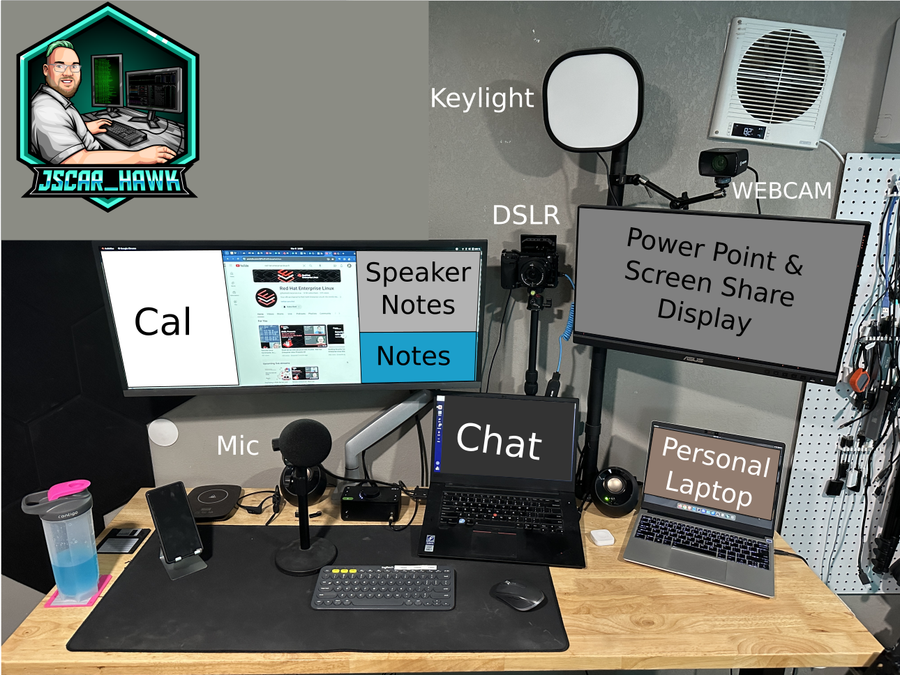

My Linux Audio and Video Setup

With a large amount the workforce going remote, I wanted to share what I am using.

## Laptop 

### Work 

* Lenovo P1 Gen3

### Personal

* Framework 13 Laptop
* Framework 16 Laptop

## Operating System

* P1 Gen3 is running RHEL 9
* Framework 13 Laptop running Fedora 39
* Framework 16 Laptop running Fedora 39

## Broadcasting Software

* [Open Broadcast Studio](https://obsproject.com)

## Microphones

### Basic

* [Razer Seiren Mini](https://amzn.to/3OXjXqw)

### Starter Mic

* [Samson Q2U USB/XLR Dynamic Microphone Recording](https://amzn.to/3uU3hcH)

### New Mic

Daily Driver
* [Rode PodMic](https://amzn.to/3P0mWyo)

## USB audio interface:

### Beginner

* This is an old reliable, great starter Interface
* [BEHRINGER UM2 Audio Interface](https://amzn.to/4bUd9Us)

### Intermediate

* This is my daily driver
* [Audient EVO 4](https://amzn.to/42USA6k)

## Headset:

### Wired

* [SENNHEISER HD 58X JUBILEE HEADPHONES](https://drop.com/buy/massdrop-x-sennheiser-hd-58x-jubilee-headphones)

* [KZ ZSN Pro X in Ear Buds Earphones](https://amzn.to/3TgRy1l)

### Wireless

* [Shokz OpenRun AfterShokz Aeropex](https://amzn.to/3AhkWKx)

* [SHOKZ OpenComm2 UC - Bone Conduction with Boom Mic and USB-C](https://amzn.to/3TgRC15)

## Mic Stand:

### Starter

* [InnoGear Heavy Duty Microphone Stand with Mic Microphone Windscreen](https://amzn.to/43KXcvR)

### Better

* [InnoGear Desktop Microphone Stand](https://amzn.to/4aavKdt)

## Webcam and DSLR:

* I am currently run 2 of the Facecam Webcams
* [Elgato Facecam](https://amzn.to/3wzziXZ)
* I Use my Sony A6400 DSLR as my daily Driver
* [Sony A6400](https://amzn.to/3uX2mYU)

## Camera Clean HDMI Check

* If you go with another camera, you will need to check for clean HDMI out.
* A great sight to check for that is https://www.elgato.com/en/cam-link/camera-check.

### SmallRig Gear

* [SmallRig Cage with Silicone Handgrip & Cold Shoe for Sony a6400](https://amzn.to/3P1j4x0)
* [SMALLRIG HDMI Cable Clamp](https://amzn.to/41fJoaZ)

### Tripod and Mounting Gear

* [Moman Tripod Fluid Drag Pan Head](https://amzn.to/41fJoaZ)
* [KingJoy 66'' Camera Tripod](https://amzn.to/41fJoaZ)
* [Dazzne Desk Mount Stand](https://amzn.to/40rtitD)
* [CAMVATE Heavy-Duty C Clamp Articulated 1/4"-20 Ball Head Support Holder (Black Locking Knob)](https://amzn.to/3oyibla)

## Here is my sit/stand desk

* [Husky 62 in. Adjustable Height Work Table](https://www.homedepot.com/p/Husky-62-in-Adjustable-Height-Work-Table-HOLT62XDB12/301810799)

## Office Chair 

* [SIHOO Office Chair with Pattern Mesh](https://amzn.to/43LW0s4)

## Video capture card

Video capture card I use types that work with linux.

If you are looking to use a DSLR Camera,
you will have to make sure it supports Clean HDMI.
Here is a great site to check for that [elgato clean hdmi check](https://www.elgato.com/en/cam-link/camera-check)

### Without pass-through HDMI

Currently Testing this card out because it treats the HDMI as UVC which acts as a camera.
So Video Calling, Camera, Mac & Linux all work out of the box.

* Cheap Option
* [Mirabox USB3.0 4K HDMI Video Capture Card](https://amzn.to/42TZ9Gd)

* Favorite Option
* [EVGA XR1 lite Capture Card](https://amzn.to/3IjocZY)

* A great option if you want to get into the elgato eco-system
* [Elgato Cam Link 4K](https://amzn.to/42YPZbw)

## Lighting Setup

### On Camera Shoe

#### Starter

* [VILTROX L116T RA CRI95 Super Slim LED Light Panel](https://amzn.to/49wuRff)

* [VILTROX 2m/6.5ft Premium External Power Supply 12V 2A Output AC/DC Adapter 100-240V Input for LED Light,L116T/L116B/L13T/L132B,VILTROX Monitor DC-70/DC-50, CE FC Certification](https://amzn.to/42WRDdA)
** There are difference power supplies, but DO NOT USE THEM IF THEY ARE NOT 12V at 2A!
** You will cook your light, and once the magic smoke is out, it can't be put back in.

#### Better

[Elgato Key Light Air](https://amzn.to/3SZ74NO)

### Back Lighting

#### Starter

* [Philips Color LED Wi-Fi Wiz Connected Wireless Light Bulb](https://amzn.to/48B51FJ)

#### Better

* [Elgato Light Strip RGBWW LEDs](https://amzn.to/3SVv5We)

## Monitor

* [Samsung 34-Inch SJ55W Ultrawide Gaming Monitor](https://amzn.to/4c8qhpl)
* [ASUS ProArt Display PA248QV 24.1” WUXGA](https://amzn.to/3IiVZCq)

## Monitor Arm

* [HUANUO Single Arm Monitor Stand](https://amzn.to/42VvZqa)
* [VIVO Extra Tall Single Monitor Desk Mount Stand 39 inch Pole](https://amzn.to/3uYm5aW)

To help fund the projects I work on, the links are Amazon Affiliate links. This will let amazon know I sent you, and give me a small kickback if you buy that product. None of these are sponsorship, they do not get to see what I am saying about the products before I post online. Theses are products that I use and recommend!
